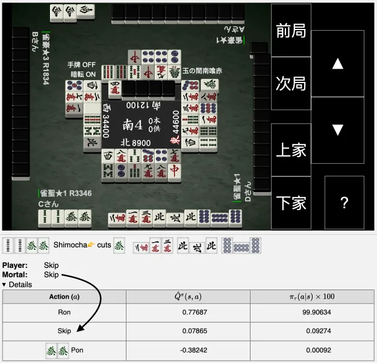

# FAQ
## Can it review three-player mahjong log?
No, it can't. Three-player mahjong is a completely different game.

## What is pt?
pt refers to the same concept of Tenhou ranking pt. Simply put, they are the weighted version of final placements at the end of the game. $[90,45,0,-135]$ is the pt distribution for a 7 dan player in Tenhou houou hanchan.

## How good are the engines in mahjong?
Unfortunately, I don't know, because I can't find a legitimate way to test it.

Tenhou rejected my AI account request for Mortal because Mortal was developed by an individual rather than a company.

### But I have seen some accounts claim to be Mortal/akochan on some online platforms?
I (Equim) have no affiliation to them. I am not running any AI in ranked lobbies and will not do so until an official permission is granted.

## How good are the engines compared against each other?
Check [Mortal's documentation](https://mortal.ekyu.moe/perf/strength.html#mortal-vs-akochan) for details.

## What information do the engines base their decisions on?
Technically, all visible information on the board is taken into account, including discard sequences with tedashi info, current points, round number and so on, but information such as each player's level and the room type are not.

## (Mortal) Where is the deal-in rate column?
If you're referring to the deal-in rate column in akochan, Mortal does not have it; in fact, it was never explicitly calculated by Mortal in the first place. Mortal and akochan are two entirely different mahjong AI engines, created by different developers with different designs. So you probably shouldn't expect them to share any features.

## (Mortal) What do the notations mean?
$P_k^p$ is a vector that consists of 4 possibility values for player $p$ to achieve the 4 corresponding placements, estimated at the start of kyoku $k$ in this game.

$\Phi_k$​ represents the estimated pt EV at the start of kyoku $k$ in a game. This value is determined using a separate model that takes into account the current scores pf all players, as well as basic board status such as kyoku, honba and kyotaku.

For instance, if the game has pt setting $w$ and the players' scores are $[29000,14200,27200,29600]$ in South 1, then the estimation is shown in the table below:

| Player | Score | 1st place (%) | 2nd place (%) | 3rd place (%) | 4th place (%) |
|:---:|:---:|:---:|:---:|:---:|:---:|
| East | 29000 | 29.532 | 32.512 | 27.416 | 10.539 |
| South | 14200 | 7.621 | 9.907 | 17.006 | 65.466 |
| West | 27200 | 24.857 | 29.048 | 31.777 | 14.317 |
| North | 29600 | 37.990 | 28.533 | 23.800 | 9.677 |

Note that these probabilities are esitmates of the **final** rankings at the end of the whole *game*, not after the current *kyoku*.

To get the $\Phi_k$​ value for the player sitting in the East seat at South 1, we multiply the probabilities with the pt setting, specifically $[0.29532, 0.32512, 0.27416, 0.10539] \cdot w$.
It's important to note that Mortal models do not guarantee to use a fixed pt setting throughout its training.

$\hat Q^\pi(s, a)$ is the [Q values](https://en.wikipedia.org/wiki/Q-learning) evaluated by the model,
at state $s$ in kyoku $k$,
where $\pi$ is the policy of the agent.
The optimization target for $\hat Q^\pi(s, a)$ is
$\Phi_{k+1} - \Phi_k$​, which is the delta of pt EV between two consecutive kyokus.

$\pi_\tau(a|s)$, in simple terms, can be thought of something similar to the heights of the bar on each tile in hand in NAGA's reviewer, though technically Mortal differs from NAGA in terms of how this distribution is produced and used. It is the output of a softmax function which takes categorical Q values produced by Mortal and then transforms them into a discrete probability distribution, calculated as

$$\pi_\tau(a|s) = \frac{\exp(\hat Q^\pi(s, a) / \tau)}{\sum_i \exp(\hat Q^\pi(s, a_i) / \tau)}$$
where $\tau$ is temperature.

Wrapping up, $\hat Q^\pi(s, a)$ is only for advanced users, because it can be very misleading if the user does not understand the subtle details of how Mortal works under the hood. I have been considering whether to just remove the column or not, but in the end I decided to keep it as is. <ins>Just look up $\pi_\tau(a|s)$ as it is easier to understand.</ins>

## (Mortal) Why do all actions except the best sometimes have significantly lower Q values than that of the best?
As mentioned above, $\hat Q^\pi(s, a) + \Phi_k$ is an estimation to the pt EV. However, the evaluation for this value is <ins>the means but not the objective</ins>. To be clear, the real fundamental objective for Mortal as a mahjong AI is to achieve the best performance in a mahjong game, but not to calculate accurate scores for all actions. As a result, the evaluated values of all actions but the best may be inaccurate; they only serve as a means to determine its preference for exploration in training.

This is an exploitation vs exploration dilemma. To begin with, Mortal is [model-free](https://en.wikipedia.org/wiki/Model-free_(reinforcement_learning)), which means it cannot determine the actual Q value $Q^\pi(s, a)$ (optimization target) without actually executing the action $a$. In other words, it cannot "search" like typical chess and go AIs.
Therefore, if we intend to make actions' Q values more accurate, the model will have to explore those less likely actions more, which may lead to overestimation on some bad actions, making it performs worse. In a game with so much randomness like mahjong, such overestimation is very likely to happen since the variance is very high. To avoid such performance regression, the model needs to exploit more, leading to less accurate predicted Q values $\hat Q^\pi(s, a)$.

ELI5: <ins>Mortal is optimized for playing, not reviewing or attribution.</ins>

## (Mortal) Can Mortal's decisions be attributed?
Mortal is an end-to-end deep learning model that deploys model-free reinforcement learning, therefore we are unlikely to be able to do any significant attribution work on it. If you insist on wanting a reason for a decision made by Mortal, I would say that in contrast to how humans play, Mortal is not based on so-called "precise calculations", but rather just "intuition".

## (Mortal) The single-line output and the table are in conflict, is it a bug?

This is an intentional feature, and in the case shown in the figure, it is a rule-based fail-safe strategy against アガラス (win-to-last-place) in the all-last round.

The single-line output (starting with `Mortal:`) is the actual final decision made by the AI, while the expanded table provides additional, intermediate information that is totally optional and may be altered or even removed in a future version. When they are in conflict, <ins>the single-line output should take precedence.</ins> Furthermore, the table is just a by-product of the AI, and focusing too much on building it may hinder finding better ways to achieve its goal.

## (akochan) How to configure the pt distribution?
Edit `jun_pt` in `tactics.json`. Note that there is a hard-coded bound of $[-200, 200]$ for every element.

## (akochan) Why does akochan act so weird sometimes?
Akochan is not good at kan. Akochan also has numerical stability issues in extreme situations.

Akochan is very aggressive about its sole goal - the "final" pt EV, instead of just winning this round.

## How is the rating calculated?
$$
100 \times (
    \frac{1}{K} \displaystyle \sum_{i=1}^K
    \frac{1}{N_i} \displaystyle \sum_{j=1}^{N_i}
    \frac
    {\hat Q^\pi(s_{i,j}, a_{i,j}) - \displaystyle \min_a \hat Q^\pi(s_{i,j}, a_{i,j})}
    {\displaystyle \max_a \hat Q^\pi(s_{i,j}, a_{i,j}) - \displaystyle \min_a \hat Q^\pi(s_{i,j}, a_{i,j})}
) ^ 2
$$

where $K$ is the number of rounds and $N_i$ is the number of player's actions in $i$-th round.

The calculation is essentially a basic min-max scaling and the result has a high variance. It is also directly tied to the output dynamic range of a specific engine (model). It shouldn't be considered a reliable measurement.
